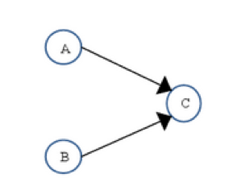

## 义码当仙之并发编程

### 一、多线程基础
> 示例项目：concurrency01-thread-basis

#### 进程与线程  
每个正在系统上运行的程序都是一个进程。每个进程包含一到多个线程。线程是一组指令的集合，或者是程序的特殊段，它可以在程序里独立执行。也可以把它理解为代码运行的上下文。所以线程基本上是轻量级的进程，它负责在单个程序里执行多任务。通常由操作系统负责多个线程的调度和执行。  
使用线程可以把占据时间长的程序中的任务放到后台去处理，程序的运行速度可能加快，在一些等待的任务实现上如用户输入、文件读写和网络收发数据等，线程就比较有用了。在这种情况下可以释放一些珍贵的资源如内存占用等等。  
如果有大量的线程会影响性能，因为操作系统需要在它们之间切换，更多的线程需要更多的内存空间，线程的中止需要考虑其对程序运行的影响。通常块模型数据是在多个线程间共享的，需要防止线程死锁情况的发生。  
总结：<font color="#dd0000">进程是所有线程的集合，每一个线程是进程中的一条执行路径。</font>

#### 为什么要使用多线程？  
提高程序的效率。

#### 多线程的使用场景
- 数据库连接池
- 迅雷下载  
此时采用多线程，只能提高下载效率，并不能提高下载速度，下载速度由网络运营商提供的带宽决定。  
多线程下载，即同一时刻，有多个线程（多个执行路径）同时执行下载任务。
- 分发短信

#### 线程的分类
- 用户线程（非守护线程）与守护线程（如GC线程）
- 主线程（一个进程中一定会有主线程）、子线程

> Java中有两种线程，一种是用户线程，另一种是守护线程。  
用户线程是指用户自定义创建的线程，主线程停止，用户线程不会停止。    
守护线程：当进程不存在或主线程停止，守护线程也会被停止。  
使用setDaemon(true)方法将线程设置为守护线程。

示例代码：concurrency01-thread-basis.DaemonThreadDemo.java  

#### 多线程的创建方式
- 方式一：继承Thread类，重写run方法  
示例代码：concurrency01-thread-basis.ThreadDemo01.java

- 方式二：实现Runnable接口，重写run方法（推荐）  
原因实现了接口还可以继续继承，继承了类不能再继承。  
示例代码：concurrency01-thread-basis.ThreadDemo02.java

- 方式三：使用匿名内部类  
示例代码：concurrency01-thread-basis.ThreadDemo03.java  

- 方式四：使用线程池进行管理

#### 同步（Synchronous）与异步（Asynchronous）
同步和异步通常来形容一次方法调用，同步方法调用一旦开始，调用者必须等到方法调用返回后，才能继续后续的行为。  
异步方法调用更像一个消息传递，一旦开始，方法调用就会立即返回，调用者就可以继续后续的操作。 
异步方法通常会在另外一个线程中“真实”地执行。整个过程，不会阻碍调用者的工作。


#### 并发（Concurrency）和并行（Parallelism）
并发和并行是两个非常容易被混淆的概念。他们都可以表示两个或者多个任务一起执行，但是侧重点有所不同。并发偏重于多个任务交替执行，而多个任务之间有可能还是串行的，而并行是真正意义上的“同时执行”。  

#### 临界区
临界区用来表示一种公共资源或者说共享数据，可以被多个线程使用，但是每一次只能有一个线程使用它，一旦临界区资源被占用，其他线程要想使用这个资源就必须等待。  

#### 阻塞（Blocking）和非阻塞（Non-Blocking）
阻塞和非阻塞通常用来形容很多线程间的相互影响。比如一个线程占用了临界区资源，那么其他所有需要这个资源的线程就必须在这个临界区中等待。等待会导致线程挂起，这种情况就是阻塞。此时，如果占用资源的线程一直不愿意释放资源，那么其他阻塞在这个临界区上的线程都不能工作。  
非阻塞的意思与之相反，它强调没有一个线程可以妨碍其他线程执行，所有的线程都会尝试不断向前执行。

#### 多线程的状态（生命周期）
线程从创建、运行到结束总是处于下面七个状态之一：新建状态、就绪状态、运行状态、阻塞状态、等待状态、超时等待状态、以及死亡状态。  


- 新建（初始）状态  
当用new操作符创建一个线程时，例如new Thread(r)，线程还没有开始运行，此时线程处在新建状态。当一个线程处于新建状态时，程序还没有开始运行线程中的代码。

- 就绪（可运行）状态  
一个新创建的线程并不自动开始运行，要执行线程，必须调用线程的start()方法。
当线程对象调用start()方法即启动了线程，start()方法创建线程运行的系统资源，并调度线程运行run()方法。
当start()方法返回后，线程就处于就绪状态。处于就绪状态的线程并不一定立即运行run()方法，线程还必须同其他线程竞争CPU时间。
只有获得CPU时间才可以运行线程。
因为在单CPU的计算机系统中，不可能同时运行多个线程，一个时刻仅有一个线程处于运行状态，因此此时可能有多个线程处于就绪状态。
对多个处于就绪状态的线程是由Java运行时系统的线程调度程序(thread scheduler)来调度的。

> 1. 就绪状态只是说明当前线程有资格运行，调度程序没有挑选到该线程，该线程就永远处于就绪状态。
> 2. 调用线程的start()方法，此线程进入就绪状态。
> 3. 当前线程sleep()方法结束，其他线程join()结束，等待用户输入完毕，某个线程拿到对象锁，这些线程也将进入就绪状态。
> 4. 当前线程时间片用完了，调用当前线程的yield()方法，当前线程进入就绪状态。
> 5. 锁池里的线程拿到对象锁后，进入就绪状态。

- 运行状态  
当线程获得CPU时间后，它才进入运行状态，真正开始执行run()方法。

- 阻塞状态  
线程运行过程中，可能由于各种原因进入阻塞状态:
> 1. 线程通过调用sleep方法进入睡眠状态；
> 2. 线程调用一个在I/O上被阻塞的操作，即该操作在输入输出操作完成之前不会返回到它的调用者；
> 3. 线程试图得到一个锁，而该锁正被其他线程持有；
> 4. 线程在等待某个触发条件；

- 等待    
处于这种状态的线程不会被分配CPU执行时间，它们要等待被显式地唤醒，否则会处于无限期等待的状态。

- 超时等待    
处于这种状态的线程不会被分配CPU执行时间，不过无须无限期等待被其他线程显示地唤醒，在达到一定时间后它们会自动唤醒。

- 死亡（终止）状态  
有两个原因会导致线程死亡：
> 1. run方法正常退出而自然死亡，
> 2. 一个未捕获的异常终止了run方法而使线程猝死。  

当线程的run()方法完成时，或者主线程的main()方法完成时，我们就认为它终止了。这个线程对象也许是活的，但是，它已经不是一个单独执行的线程。线程一旦终止了，就不能复生。  
在一个终止的线程上调用start()方法，会抛出java.lang.IllegalThreadStateException异常。  
为了确定线程在当前是否存活着（就是要么是可运行的，要么是被阻塞了），需要使用isAlive方法。如果是可运行或被阻塞，这个方法返回true； 如果线程仍旧是new状态且不是可运行的，或者线程死亡了，则返回false。

#### 常用线程API

|API|描述|
|:----|:----|
|start()|启动线程|
|currentThread()|获取当前线程对象|
|getID()|获取当前线程ID。Thread-编号，该编号从0开始|
|getName()|获取当前线程名称|
|sleep(long mill)|休眠线程|
|stop()|停止线程|
|Thread()|分配一个新的Thread对象|
|Thread(String name)|分配一个新的Thread对象，具有指定的name。|
|Thread(Runable r)|分配一个新的Thread对象|
|Thread(Runable r, String name)|分配一个新的Thread对象|
 
#### join()方法
当在主线程当中执行到t1.join()方法时，就认为主线程应该把执行权让给t1  
示例代码：concurrency01-thread-basis.ThreadJoinDemo.java  

#### 线程的优先级
现代操作系统基本采用时分的形式调度运行的线程，线程分配得到的时间片的多少决定了线程使用处理器资源的多少，也对应了线程优先级这个概念。  
在JAVA线程中，通过一个int priority来控制优先级，范围为1-10，其中10最高，默认值为5。下面是源码（基于1.8）中关于priority的一些量和方法。  
示例代码：concurrency01-thread-basis.ThreadPriorityDemo.java    

#### yield()方法
Thread.yield()方法的作用：暂停当前正在执行的线程，并执行其他线程。（可能没有效果）  
yield()让当前正在运行的线程回到可运行状态，以允许具有相同优先级的其他线程获得运行的机会。  
因此，使用yield()的目的是让具有相同优先级的线程之间能够适当的轮换执行。但是，实际中无法保证yield()达到让步的目的，因为，让步的线程可能被线程调度程序再次选中。  
结论：大多数情况下，yield()将导致线程从运行状态转到可运行状态，但有可能没有效果。  

<hr>

### 二、Java内存模型（JMM）
> 示例项目：concurrency02-jmm

#### 线程安全
> 引用《深入理解Java虚拟机》中的定义：
当多个线程访问同一个对象时，如果不用考虑这些线程在运行时环境下的调度和交替运行，也不需要进行额外的同步，或者在调用方进行任何其他的协调操作，调用这个对象的行为都可以获取正确的结果，那这个对象是线程安全的。
  
当多个线程共享同一个全局变量，做写操作的时候，可能会受到其他线程的干扰，做读操作的时候不会发生线程安全问题。—— Java内存模型  

#### 线程安全解决办法
1. 问：如何解决多线程之间线程安全问题？  
答：使用多线程之间同步synchronized或使用锁（lock）。

2. 问：为什么使用线程同步或使用锁能解决线程安全问题呢？  
答：将可能会发生数据冲突问题（线程不安全问题）的临界区，只能让当前一个线程进行执行。代码执行完成后释放锁，然后才能让其他线程进行执行。这样就可以解决线程不安全问题。

3. 问：什么是多线程同步？  
答：当多个线程共享同一个资源，不会受到其他线程的干扰。

> 线程安全示例（多窗口抢票）代码：concurrency02-jmm.GrabTicketDemo  

#### 内置锁（synchronized）
Java提供了一种内置的锁机制来支持原子性。
每一个Java对象都可以用作一个实现同步的锁，称为内置锁，线程进入同步代码块之前自动获取到锁，代码块执行完成正常退出或代码块中抛出异常退出时会释放掉锁。  
内置锁为互斥锁，即线程A获取到锁后，线程B阻塞直到线程A释放锁，线程B才能获取到同一个锁。  
内置锁使用synchronized关键字实现，synchronized关键字有两种用法：  
1. 修饰需要进行同步的方法（所有访问状态变量的方法都必须进行同步），此时充当锁的对象为调用同步方法的对象； 
2. 同步代码块和直接使用synchronized修饰需要同步的方法是一样的，但是锁的粒度可以更细，并且充当锁的对象不一定是this，也可以是其它对象，所以使用起来更加灵活。 

- 同步代码块synchronized  
```text
将可能会发生线程安全问题的代码，包括起来
synchronized(同一个数据){
   可能会发生线程冲突问题
}

同步代码块 
synchronized(对象)//这个对象可以为任意对象 
{ 
   需要被同步的代码 
}
```
示例代码：  
```java
private void sale() {
    // 同步代码块，锁可以是this或者任意全局对象
    synchronized (this){
        if(count > 0){
            System.out.println(Thread.currentThread().getName() + ", 正在出售第" + (100 - count + 1) + "张票...");
            count --;
        }
    }
}
```

> 对象如同锁，持有锁的线程可以在同步中执行。没持有锁的线程即使获取CPU的执行权，也进不去。  
> 同步的前提： 
> 1. 必须要有两个或者两个以上的线程   
> 2. 必须是多个线程使用同一个锁
>   
> 必须保证同步中只能有一个线程在运行。  
> 1. 好处：解决了多线程的安全问题  
> 2. 弊端：多个线程需要判断锁、抢锁，较为消耗资源

- 同步（非静态）方法：在方法上修饰synchronized称为同步方法。  
 
示例代码： 
```java
private synchronized void sale() {
    // 注意这里必须再判断一次。当余票只剩最后一张，假设窗口1先获取到锁，执行下面的购买，将买到第100张票，此时余票为0。
    // 与此同时，窗口1释放锁，并由窗口2获取到锁继续购票，则将买到第101张票。即发生了超票购买的线程安全问题。。。
    if(count > 0){
        System.out.println(Thread.currentThread().getName() + ", 正在出售第" + (100 - count + 1) + "张票...");
        count --;
    }
}
```
问：非静态同步方法使用的是什么锁？  
答：非静态同步方法使用this锁。  
证明方式: 一个线程使用同步代码块(this锁)，另一个线程使用同步函数。如果两个线程抢票不能实现同步，那么会出现数据错误。  
> 证明示例代码: concurrency02-jmm.Test01.java 

- 静态同步方法  

问：什么是静态同步方法？  
答：方法上加上static关键字，使用 synchronized 关键字修饰或者使用 类.class 文件。  
静态的同步方法使用的锁是该方法所属字节码文件对象。  
可以用getClass方法获取，也可以用当前类名.class表示。 

示例代码：  
```java
private static void sale() {
    // 同步代码块，锁可以是this 或者任意对象
    synchronized (TicketSalesThread.class){
        if(count > 0){
            System.out.println(Thread.currentThread().getName() + ", 正在出售第" + (100 - count + 1) + "张票...");
            count --;
        }
    }
}
```
> 总结：
> 1. synchronized 修饰非静态方法使用的锁是当前对象的this锁。  
> 2. synchronized 修饰静态方法使用的锁是当前类的字节码文件。  

#### 死锁（Deadlock）、饥饿（Starvation）和活锁（Livelock）
死锁、饥饿和活锁都属于多线程的活跃性问题。如果发现上述几种情况，那么相关线程就不再活跃，也就是说它可能很难再继续往下执行了。

死锁应该是最糟糕的一种情况了（当然，其他几种情况也好不到哪里去），如下图显示了一个死锁的发生：  


A、B、C、D四辆小车都在这种情况下都无法继续行驶了。他们彼此之间相互占用了其他车辆的车道，如果大家都不愿意释放自己的车道，那么这个状况将永远持续下去，谁都不可能通过，死锁是一个很严重的并且应该避免和实时小心的问题。

饥饿是指某一个或者多个线程因为种种原因无法获得所要的资源，导致一直无法执行。比如它的优先级可能太低，而高优先级的线程不断抢占它需要的资源，导致低优先级线程无法工作。在自然界中，母鸡给雏鸟喂食很容易出现这种情况：由于雏鸟很多，食物有限，雏鸟之间的食物竞争可能非常厉害，经常抢不到食物的雏鸟有可能被饿死。线程的饥饿非常类似这种情况。此外，某一个线程一直占着关键资源不放，导致其他需要这个资源的线程无法正常执行，这种情况也是饥饿的一种。于死锁想必，饥饿还是有可能在未来一段时间内解决的（比如，高优先级的线程已经完成任务，不再疯狂执行）。

活锁是一种非常有趣的情况。不知道大家是否遇到过这么一种场景，当你要做电梯下楼时，电梯到了，门开了，这是你正准备出去。但很不巧的是，门外一个人当着你的去路，他想进来。于是，你很礼貌地靠左走，礼让对方。同时，对方也非常礼貌的靠右走，希望礼让你。结果，你们俩就又撞上了。于是乎，你们都意识到了问题，希望尽快避让对方，你立即向右边走，同时，他立即向左边走。结果，又撞上了！不过介于人类的智慧，我相信这个动作重复两三次后，你应该可以顺利解决这个问题。因为这个时候，大家都会本能地对视，进行交流，保证这种情况不再发生。但如果这种情况发生在两个线程之间可能就不那么幸运了。如果线程智力不够。且都秉承着“谦让”的原则，主动将资源释放给他人使用，那么久会导致资源不断地在两个线程间跳动，而没有一个线程可以同时拿到所有资源正常执行。这种情况就是活锁。

#### 死锁产生原因：同步中嵌套同步  

> 示例代码: concurrency02-jmm.DeadLockDemo

查看死锁日志信息：  
```text
jps
jstack ${pid} >> DeadLockDemo.txt
```

#### ThreadLocal  
ThreadLocal提供一个线程局部变量，访问某个线程拥有自己局部变量。  
当使用ThreadLocal维护变量时，ThreadLocal为每个使用该变量的线程提供独立的变量副本，所以每一个线程都可以独立地改变自己的副本，而不会影响其它线程所对应的副本。

ThreadLocal的接口方法：
- void set(Object value)  
设置当前线程的线程局部变量的值。  
- public Object get()  
该方法返回当前线程所对应的线程局部变量。  
- public void remove()  
将当前线程局部变量的值删除，目的是为了减少内存的占用，该方法是JDK 5.0新增的方法。  
需要指出的是，当线程结束后，对应该线程的局部变量将自动被垃圾回收，所以显式调用该方法清除线程的局部变量并不是必须的操作，但它可以加快内存回收的速度。   
- protected Object initialValue()  
返回该线程局部变量的初始值，该方法是一个protected的方法，显然是为了让子类覆盖而设计的。  
这个方法是一个延迟调用方法，在线程第1次调用get()或set(Object)时才执行，并且仅执行1次。  
ThreadLocal中的缺省实现直接返回一个null。 

> 示例代码：concurrency02-jmm.ThreadLocalDemo

ThreadLocal实现原理：ThreadLocal通过map集合，map.put("当前线程", 值);


### 多线程三大特性：原子性、可见性、有序性
- 什么是原子性

> 即一个操作或者多个操作，要么全部执行并且执行的过程不会被任何因素打断，要么就都不执行。
一个很经典的例子就是银行账户转账问题：   
比如从账户A向账户B转1000元，那么必然包括2个操作：从账户A减去1000元，往账户B加上1000元。这2个操作必须要具备原子性才能保证不出现一些意外的问题。  
我们操作数据也是如此，比如i = i+1；其中就包括：读取i的值，计算i，写入i。  
这行代码在Java中是不具备原子性的，则多线程运行肯定会出问题，所以也需要我们使用同步和lock这些东西来确保这个特性了。   
原子性其实就是保证数据一致、线程安全一部分  

- 什么是可见性

> 当多个线程访问同一个变量时，一个线程修改了这个变量的值，其他线程能够立即看得到修改的值。  
若两个线程在不同的cpu，那么线程1改变了i的值还没刷新到主存，线程2又使用了i，那么这个i值肯定还是之前的，线程1对变量的修改线程没看到，这就是可见性问题。  

- 什么是有序性

> 程序执行的顺序按照代码的先后顺序执行。  
一般来说处理器为了提高程序运行效率，可能会对输入代码进行优化，它不保证程序中各个语句的执行先后顺序同代码中的顺序一致，但是它会保证程序最终执行结果和代码顺序执行的结果是一致的。如下：  
```java
int a = 10;   //语句1  
int r = 2;    //语句2  
a = a + 3;    //语句3  
r = a*a;      //语句4  
```
因为指令的重排序，执行顺序可能为 2-1-3-4，1-3-2-4，但绝不可能为 2-1-4-3，因为这打破了依赖关系。  
显然重排序对单线程运行是不会有任何问题，而多线程就不一定了，所以我们在多线程编程时就得考虑这个问题。 

### Java内存模型

> 共享内存模型指的就是Java内存模型(简称JMM)。JMM决定一个线程对共享变量写入时，能对另一个线程可见。  
从抽象的角度来看，JMM定义了线程和主内存之间的抽象关系：线程之间的共享变量存储在主内存（main memory）中，  
每个线程都有一个私有的本地内存（local memory），本地内存中存储了该线程以读/写共享变量的副本。  
本地内存是JMM的一个抽象概念，并不真实存在。它涵盖了缓存，写缓冲区，寄存器以及其他的硬件和编译器优化。  


> 从上图来看，线程A与线程B之间如要通信的话，必须要经历下面2个步骤：  
> 1. 首先，线程A把本地内存A中更新过的共享变量刷新到主内存中去。  
> 2. 然后，线程B到主内存中去读取线程A之前已更新过的共享变量。

下面通过示意图来说明这两个步骤： 

 

> 如上图所示，本地内存A和B有主内存中共享变量x的副本。假设初始时，这三个内存中的x值都为0。    
线程A在执行时，把更新后的x值（假设值为1）临时存放在自己的本地内存A中。  
当线程A和线程B需要通信时，线程A首先会把自己本地内存中修改后的x值刷新到主内存中，此时主内存中的x值变为了1。  
随后，线程B到主内存中去读取线程A更新后的x值，此时线程B的本地内存的x值也变为了1。  
从整体来看，这两个步骤实质上是线程A在向线程B发送消息，而且这个通信过程必须要经过主内存。  
JMM通过控制主内存与每个线程的本地内存之间的交互，来为java程序员提供内存可见性保证。  

> 总结：什么是Java内存模型？  
java内存模型简称jmm，定义了一个线程对另一个线程可见。  
共享变量存放在主内存中，每个线程都有自己的本地内存，当多个线程同时访问一个数据的时候，可能本地内存没有及时刷新到主内存，所以就会发生线程安全问题。  

### volatile

> 可见性也就是说一旦某个线程修改了该被volatile修饰的变量，它会保证修改的值会立即被更新到主存，当有其他线程需要读取时，可以立即获取修改之后的值。  
在Java中为了加快程序的运行效率，对一些变量的操作通常是在该线程的寄存器或是CPU缓存上进行的，之后才会同步到主存中，而加了volatile修饰符的变量则是直接读写主存。  
volatile 保证了线程间共享变量的及时可见性，但不能保证原子性。

> 示例代码：concurrency02-jmm.VolatileDemo.java

已经将结果设置为fasle，为什么还一直在运行呢？  
原因：线程之间是不可见的，读取的是副本，没有及时读取到主内存结果。  
解决办法使用Volatile关键字将解决线程之间可见性, 强制线程每次读取该值的时候都去“主内存”中取值。

#### volatile特性
1. 保证变量对所有的线程的可见性，当一个线程修改了这个变量的值，volatile 保证了新值能立即同步到主内存，以及每次使用前立即从主内存刷新。  
但普通变量做不到这点，普通变量的值在线程间传递均需要通过主内存来完成。
2. 禁止指令重排序优化。有volatile修饰的变量，赋值后多执行了一个“load addl $0x0, (%esp)”操作，  
这个操作相当于一个内存屏障（指令重排序时不能把后面的指令重排序到内存屏障之前的位置），只有一个CPU访问内存时，并不需要内存屏障；  
（什么是指令重排序：是指CPU采用了允许将多条指令不按程序规定的顺序分开发送给各相应电路单元处理）

volatile 性能：volatile 的读性能消耗与普通变量几乎相同，但是写操作稍慢，因为它需要在本地代码中插入许多内存屏障指令来保证处理器不发生乱序执行。  

#### volatile与synchronized区别
1. synchronized保证操作的原子性和内存可见性；  
2. volatile只能保证内存可见性；  
3. volatile不需要加锁，比synchronized更轻量级，并不会阻塞线程（volatile不会造成线程的阻塞；synchronized可能会造成线程的阻塞）；  
4. volatile标记的变量不会被编译器优化，而synchronized标记的变量可以被编译器优化（比如编译器重排序的优化）；  
5. volatile是变量修饰符，仅能用于变量，而synchronized是一个方法和块的修饰符。  
volatile本质是在告诉JVM当前变量在寄存器中的值是不确定的，使用前需要先从主存中读取，因此可以实现可见行。而对于n=n+1,n++等操作，volatile关键字将失效，不能起到像synchronized一样的线程同步（原子性）的效果。

### 重排序
是指CPU采用了允许将多条指令不按程序规定的顺序分开发送给各相应电路单元处理。  
通俗的描述： CPU会对代码的执行进行优化，但不会对有依赖关系的代码做重排序，代码的执行顺序可能会发生变化，但是执行的结果不会发生改变。

#### 数据依赖性
如果两个操作访问同一个变量，且这两个操作中有一个为写操作，此时这两个操作之间就存在数据依赖性。数据依赖分下列三种类型：

|名称|代码示例|说明|
|:----|:----|:----|
|写后读|a = 1;b = a;|写一个变量之后，再读这个位置|
|写后写|a = 1;a = 2;|写一个变量之后，再写这个变量|
|读后写|a = b;b = 1;|读一个变量之后，再写这个变量|

上面三种情况，只要重排序两个操作的执行顺序，程序的执行结果将会被改变。  
编译器和处理器可能会对操作做重排序。编译器和处理器在重排序时，会遵守数据依赖性，编译器和处理器不会改变存在数据依赖关系的两个操作的执行顺序。  
注意，这里所说的数据依赖性仅针对单个处理器中执行的指令序列和单个线程中执行的操作，不同处理器之间和不同线程之间的数据依赖性不被编译器和处理器考虑。  

#### as-if-serial语义  

as-if-serial语义的意思指：不管怎么重排序（编译器和处理器为了提高并行度），（单线程）程序的执行结果不能被改变。  
编译器，runtime 和处理器都必须遵守as-if-serial语义。  
为了遵守as-if-serial语义，编译器和处理器不会对存在数据依赖关系的操作做重排序，因为这种重排序会改变执行结果。  
但是，如果操作之间不存在数据依赖关系，这些操作可能被编译器和处理器重排序。  
为了具体说明，请看下面计算圆面积的代码示例：
```java
double pi  = 3.14;        //A
double r   = 1.0;         //B
double area = pi * r * r; //C
```
上面三个操作的数据依赖关系如下图所示：  



如上图所示，A和C之间存在数据依赖关系，同时B和C之间也存在数据依赖关系。  
因此在最终执行的指令序列中，C不能被重排序到A和B的前面（C排到A和B的前面，程序的结果将会被改变）。  
但A和B之间没有数据依赖关系，编译器和处理器可以重排序A和B之间的执行顺序。下图是该程序的两种执行顺序：  

  

as-if-serial语义把单线程程序保护了起来，遵守as-if-serial语义的编译器，runtime 和处理器共同为编写单线程程序的程序员创建了一个幻觉：单线程程序是按程序的顺序来执行的。  
as-if-serial语义使单线程程序员无需担心重排序会干扰他们，也无需担心内存可见性问题。  

#### 程序顺序规则

根据happens- before的程序顺序规则，上面计算圆的面积的示例代码存在三个happens-before关系：  
```text
1. A happens-before B；
2. B happens-before C；
3. A happens-before C；
```
这里的第3个happens- before关系，是根据happens-before的传递性推导出来的。  
这里A happens-before B，但实际执行时B却可以排在A之前执行（看上面的重排序后的执行顺序）。  
如果A happens-before B，JMM并不要求A一定要在B之前执行。  
JMM仅仅要求前一个操作（执行的结果）对后一个操作可见，且前一个操作按顺序排在第二个操作之前。  
这里操作A的执行结果不需要对操作B可见；而且重排序操作A和操作B后的执行结果，与操作A和操作B按happens-before顺序执行的结果一致。  
在这种情况下，JMM会认为这种重排序并不非法（not illegal），JMM允许这种重排序。  
在计算机中，软件技术和硬件技术有一个共同的目标：在不改变程序执行结果的前提下，尽可能的开发并行度。  
编译器和处理器遵从这一目标，从happens-before的定义我们可以看出，JMM同样遵从这一目标。  

#### 重排序对多线程的影响  
```java
class ReorderExample {
    int a = 0;
    boolean flag = false;

    public void writer() {
        a = 1;                     //1
        flag = true;               //2
    }

    public void reader() {
        if (flag) {                //3
            int i =  a * a;        //4
            ……
        }
    }
}
```
flag变量是个标记，用来标识变量a是否已被写入。这里假设有两个线程A和B，A首先执行writer()方法，随后B线程接着执行reader()方法。线程B在执行操作4时，能否看到线程A在操作1对共享变量a的写入？  
答案是：不一定能看到。  

由于操作1和操作2没有数据依赖关系，编译器和处理器可以对这两个操作重排序；同样，操作3和操作4没有数据依赖关系，编译器和处理器也可以对这两个操作重排序。  
让我们先来看看，当操作1和操作2重排序时，可能会产生什么效果？请看下面的程序执行时序图：  

  

如上图所示，操作1和操作2做了重排序。程序执行时，线程A首先写标记变量flag，随后线程B读这个变量。  
由于条件判断为真，线程B将读取变量a。此时，变量a还根本没有被线程A写入，在这里多线程程序的语义被重排序破坏了！  

注：用红色的虚箭线表示错误的读操作，用绿色的虚箭线表示正确的读操作。  

下面再让我们看看，当操作3和操作4重排序时会产生什么效果（借助这个重排序，可以顺便说明控制依赖性）。下面是操作3和操作4重排序后，程序的执行时序图：  

  

在程序中，操作3和操作4存在控制依赖关系。当代码中存在控制依赖性时，会影响指令序列执行的并行度。  
为此，编译器和处理器会采用猜测（Speculation）执行来克服控制相关性对并行度的影响。  
以处理器的猜测执行为例，执行线程B的处理器可以提前读取并计算a*a，然后把计算结果临时保存到一个名为重排序缓冲（reorder buffer ROB）的硬件缓存中。  
当接下来操作3的条件判断为真时，就把该计算结果写入变量i中。

从图中我们可以看出，猜测执行实质上对操作3和4做了重排序。重排序在这里破坏了多线程程序的语义！

在单线程程序中，对存在控制依赖的操作重排序，不会改变执行结果（这也是as-if-serial语义允许对存在控制依赖的操作做重排序的原因）；  
但在多线程程序中，对存在控制依赖的操作重排序，可能会改变程序的执行结果。  

<hr>

## 三、多线程之间通讯  
> 示例项目：concurrency03-thread-communication

### 什么是多线程之间通讯？  
多线程之间通讯，其实就是多个线程在操作同一个资源，但是操作的动作不同。  

### 生产者与消费者  
> 示例代码：concurrency03-thread-communication.ProducterCustomerDemo.java

### wait、notify方法  
1. 因为涉及到对象锁，wait、notify必须都放在synchronized中来使用，持有同一把锁；   
2. wait必须暂定当前正在执行的线程，并释放资源锁，让其他线程可以有机会运行；  
3. notify/notifyall：唤醒因锁池中的线程，使之运行。  
注意：一定要在线程同步中使用，并且是同一个锁的资源！  

### wait与sleep区别  
1. 对于sleep()方法，首先要知道该方法是属于Thread类中的，而wait()方法则是属于Object类中的。  
2. sleep()方法导致程序暂停执行指定的时间，让出cpu时间片给其他线程，但是他的监控状态依然保持者，当指定的时间到了又会自动恢复运行状态。在调用sleep()方法的过程中，线程不会释放对象锁。  
3. 当调用wait()方法的时候，线程会放弃对象锁，进入等待此对象的等待锁定池，只有针对此对象调用notify()方法后本线程才进入对象锁定池准备获取对象锁进入运行状态。  

### lock锁
在 jdk1.5 之后，并发包中新增了 Lock 接口和相关实现类，用来实现锁功能，Lock 接口提供了与 synchronized 关键字类似的同步功能，但需要在使用时手动获取锁和释放锁。  

> 示例代码：concurrency03-thread-communication.ProducterCustomerDemo2.java

#### lock用法  
```java
Lock lock = new ReentrantLock();
lock.lock();
try{
    // 可能会出现线程安全的操作
}finally{
    // 一定在finally中释放锁
    // 也不能把获取锁在try中进行，因为有可能在获取锁的时候抛出异常
    lock.unlock();
}
```

#### Lock与synchronized关键字的区别  
Lock接口可以尝试非阻塞地获取锁。当前线程尝试获取锁，如果这一时刻锁没有被其他线程获取到，则成功获取并持有锁。  
Lock接口能被中断地获取锁。 与 synchronized 不同，获取到锁的线程能够响应中断，当获取到的锁的线程被中断时，中断异常将会被抛出，同时锁会被释放。  
Lock接口在指定的截止时间之前获取锁，如果截止时间到了依旧无法获取锁，则返回。  

#### condition用法
condition的功能类似于在传统的线程技术中，Object.wait()和Object.notify()的功能。  

```java
Lock lock = new ReentrantLock();
Condition condition = lock.newCondition();
res.condition.await();  // 类似wait
res.condition.signal(); // 类似notify
```

<hr>

## 线程池原理分析  
> 示例项目：concurrency04-thread-pool  

### 并发包

#### CountDownLatch（计数器）
CountDownLatch 类位于java.util.concurrent包下，利用它可以实现类似计数器的功能。  
比如有一个任务A，它要等待其他2个任务执行完毕之后才能执行，此时就可以利用CountDownLatch来实现这种功能了。  
CountDownLatch是通过一个计数器来实现的，计数器的初始值为线程的数量。每当一个线程完成了自己的任务后，计数器的值就会减1。  
当计数器值到达0时，它表示所有的线程已经完成了任务，然后在闭锁上等待的线程就可以恢复执行任务。  

> 示例代码：concurrency04-thread-pool.CountDownLatchDemo.java

#### CyclicBarrier（屏障）

CyclicBarrier初始化时规定一个数目，然后计算调用了CyclicBarrier.await()进入等待的线程数。当线程数达到了这个数目时，所有进入等待状态的线程被唤醒并继续。  
CyclicBarrier就象它名字的意思一样，可看成是个障碍， 所有的线程必须到齐后才能一起通过这个障碍。   
CyclicBarrier初始时还可带一个Runnable的参数， 此Runnable任务在CyclicBarrier的数目达到后，所有其它线程被唤醒前被执行。  

> 示例代码：concurrency04-thread-pool.CyclicBarrierDemo.java

#### Semaphore（计数信号量）
Semaphore是一种基于计数的信号量。它可以设定一个阈值，基于此，多个线程竞争获取许可信号，申请到后用完归还，超过阈值后，线程申请许可信号将会被阻塞。  
Semaphore可以用来构建一些对象池，资源池之类的，比如数据库连接池，我们也可以创建计数为1的Semaphore，将其作为一种类似互斥锁的机制，这也叫二元信号量，表示两种互斥状态。它的用法如下：  
```java
semaphore.availablePermits(); // 获取当前可用的资源数量    
semaphore.acquire();          // 申请资源    
semaphore.release();          // 释放资源   
```

> 示例代码：concurrency04-thread-pool.SemaphoreDemo.java    
 
### 并发队列

在并发队列上JDK提供了两套实现：  
1. 以ConcurrentLinkedQueue为代表的高性能非阻塞队列，  
2. 以BlockingQueue接口为代表的阻塞队列。  
无论哪种都实现了Queue接口。  

### 阻塞队列与非阻塞队  
阻塞队列与普通队列的区别在于，当队列是空的时，从队列中获取元素的操作将会被阻塞，或者当队列是满时，往队列里添加元素的操作会被阻塞。  
试图从空的阻塞队列中获取元素的线程将会被阻塞，直到其他的线程往空的队列插入新的元素。同样，试图往已满的阻塞队列中添加新元素的线程同样也会被阻塞，  
直到其他的线程使队列重新变得空闲起来，如从队列中移除一个或者多个元素，或者完全清空队列。  

1. ArrayDeque：数组双端队列   
2. PriorityQueue：优先级队列   
3. ConcurrentLinkedQueue：基于链表的并发队列   
4. DelayQueue：延期阻塞队列（阻塞队列实现了BlockingQueue接口）   
5. ArrayBlockingQueue：基于数组的并发阻塞队列   
6. LinkedBlockingQueue：基于链表的FIFO阻塞队列  
7. LinkedBlockingDeque：基于链表的FIFO双端阻塞队列  
8. PriorityBlockingQueue：带优先级的无界阻塞队列  
9. SynchronousQueue：并发同步阻塞队列  

#### ConcurrentLinkedQueue  
是一个适用于高并发场景下的队列，通过无锁的方式，实现了高并发状态下的高性能。  
通常ConcurrentLinkedQueue性能好于BlockingQueue。它是一个基于链接节点的无界线程安全队列。  
该队列的元素遵循先进先出的原则。头是最先加入的，尾是最近加入的，该队列不允许null元素。  
ConcurrentLinkedQueue重要方法:  
```text
add()和offer()：都是加入元素的方法（在ConcurrentLinkedQueue中这两个方法没有任何区别）  
poll()和peek()：都是取头元素节点，区别在于前者会删除元素，后者不会。  
```
> 示例代码：concurrency04-thread-pool.ConcurrentLinkedQueueDemo

#### BlockingQueue
阻塞队列（BlockingQueue）是一个支持两个附加操作的队列，这两个附加的操作是：  
1. 在队列为空时，获取元素的线程会等待队列变为非空。  
2. 当队列满时，存储元素的线程会等待队列可用。  

阻塞队列常用于生产者和消费者的场景，生产者是往队列里添加元素的线程，消费者是从队列里拿取元素的线程。  
阻塞队列就是生产者存放元素的容器，而消费者也只从容器里拿取元素。  

BlockingQueue即阻塞队列，从阻塞这个词可以看出，在某些情况下对阻塞队列的访问可能会造成阻塞。被阻塞的情况主要有如下两种：  
1. 当队列满了的时候进行入队列操作  
2. 当队列空了的时候进行出队列操作  

因此，当一个线程试图对一个已经满了的队列进行入队列操作时，它将会被阻塞，除非有另一个线程做了出队列操作；   
同样，当一个线程试图对一个空队列进行出队列操作时，它将会被阻塞，除非有另一个线程进行了入队列操作。  

在Java中，BlockingQueue的接口位于java.util.concurrent包中（在Java5版本开始提供），由上面介绍的阻塞队列的特性可知，阻塞队列是线程安全的。  

在新增的concurrent包中，BlockingQueue很好的解决了多线程中，如何高效安全“传输”数据的问题。  
通过这些高效并且线程安全的队列类，为我们快速搭建高质量的多线程程序带来极大的便利。

常用的队列主要有以下两种：（当然通过不同的实现方式，还可以延伸出很多不同类型的队列，DelayQueue就是其中的一种）
先进先出（FIFO）：先插入的队列的元素也最先出队列，类似于排队的功能。从某种程度上来说这种队列也体现了一种公平性。  
后进先出（LIFO）：后插入队列的元素最先出队列，这种队列优先处理最近发生的事件。  

多线程环境中，通过队列可以很容易实现数据共享，比如经典的“生产者”和“消费者”模型中，通过队列可以很便利地实现两者之间的数据共享。  
假设我们有若干生产者线程，另外又有若干个消费者线程。如果生产者线程需要把准备好的数据共享给消费者线程，利用队列的方式来传递数据，就可以很方便地解决他们之间的数据共享问题。  
但如果生产者和消费者在某个时间段内，万一发生数据处理速度不匹配的情况呢？  
理想情况下，如果生产者产出数据的速度大于消费者消费的速度，并且当生产出来的数据累积到一定程度的时候，那么生产者必须暂停等待一下（阻塞生产者线程），以便等待消费者线程把累积的数据处理完毕，反之亦然。  
然而，在concurrent包发布以前，在多线程环境下，我们每个程序员都必须去自己控制这些细节，尤其还要兼顾效率和线程安全，而这会给我们的程序带来不小的复杂度。  
好在此时，强大的concurrent包横空出世了，而他也给我们带来了强大的BlockingQueue。  
（在多线程领域：所谓阻塞，在某些情况下会挂起线程（即阻塞），一旦条件满足，被挂起的线程又会自动被唤醒）  

#### ArrayBlockingQueue  
ArrayBlockingQueue是一个有边界的阻塞队列，它的内部实现是一个数组。有边界的意思是它的容量是有限的，我们必须在其初始化的时候指定它的容量大小，容量大小一旦指定就不可改变。    
ArrayBlockingQueue是以先进先出的方式存储数据，最新插入的对象是尾部，最新移出的对象是头部。  

> 示例代码：concurrency04-thread-pool.ArrayBlockingQueueDemo.java

#### LinkedBlockingQueue  
LinkedBlockingQueue阻塞队列容量大小的配置是可选的，如果我们初始化时指定一个大小，它就是有边界的，如果不指定，它就是无边界的。  
说是无边界，其实是采用了默认大小为Integer.MAX_VALUE的容量 。它的内部实现是一个链表。  
和ArrayBlockingQueue一样，LinkedBlockingQueue也是以先进先出的方式存储数据，最新插入的对象是尾部，最新移出的对象是头部。  

> 示例代码：concurrency04-thread-pool.LinkedBlockingQueueDemo.java

#### PriorityBlockingQueue
PriorityBlockingQueue是一个没有边界的队列，它的排序规则和java.util.PriorityQueue一样。  
需要注意是，PriorityBlockingQueue中允许插入null对象的。  
所有插入PriorityBlockingQueue的对象必须实现java.lang.Comparable接口，队列优先级的排序规则就是按照我们对这个接口的实现来定义的。    
另外，我们可以从PriorityBlockingQueue获得一个迭代器Iterator，但这个迭代器并不保证按照优先级顺序进行迭代。  

#### SynchronousQueue
SynchronousQueue队列内部仅允许容纳一个元素。当一个线程插入一个元素后会被阻塞，除非这个元素被另一个线程消费。  


### 线程池

#### 什么是线程池  
Java中的线程池是运用场景最多的并发框架，几乎所有需要异步或并发执行任务的程序都可以使用线程池。  
在开发过程中，合理地使用线程池能够带来3个好处：  
1. 降低资源消耗。通过重复利用已创建的线程降低线程创建和销毁造成的消耗。  
2. 提高响应速度。当任务到达时，任务可以不需要等到线程创建就能立即执行。  
3. 提高线程的可管理性。线程是稀缺资源，如果无限制地创建，不仅会消耗系统资源，还会降低系统的稳定性，使用线程池可以进行统一分配、调优和监控，但是要做到合理利用。  

#### 线程池作用
线程池是为突然大量爆发的线程设计的，通过有限的几个固定线程为大量的操作服务，减少了创建和销毁线程所需的时间，从而提高效率。  
如果一个线程的时间非常长，就没必要用线程池了（不是不能做长时间操作，而是不宜），况且我们还不能控制线程池中线程的开始、挂起和中止。  

#### ThreadPoolExecutor
Java是天生就支持并发的语言，支持并发意味着多线程，线程的频繁创建在高并发及大数据量是非常消耗资源的，因此java提供了线程池。    
在JDK1.5以前的版本中，线程池的使用是及其简陋的，但是在JDK1.5后，有了很大的改善。    
JDK1.5之后加入了java.util.concurrent包，java.util.concurrent包的加入给予开发人员开发并发程序以及解决并发问题很大的帮助。    
并发包下的Executor接口虽然作为一个非常旧的接口（JDK1.5 2004年发布），但是很多程序员对于其中的一些原理还是不熟悉。  
Executor框架的最顶层实现是ThreadPoolExecutor类，  
Executors工厂类中提供的newScheduledThreadPool、newFixedThreadPool、newCachedThreadPool方法其实也只是ThreadPoolExecutor的构造函数参数不同而已。  
通过传入不同的参数，就可以构造出适用于不同应用场景下的线程池。

```text
// 构造方法
public ThreadPoolExecutor(int corePoolSize,
                          int maximumPoolSize,
                          long keepAliveTime,
                          TimeUnit unit,
                          BlockingQueue<Runnable> workQueue,
                          ThreadFactory threadFactory,
                          RejectedExecutionHandler handler)
                          
// 参数
corePoolSize - 即使空闲时仍保留在池中的线程数，除非设置allowCoreThreadTimeOut
maximumPoolSize - 池中允许的最大线程数
keepAliveTime - 当线程数大于内核时，这是多余的空闲线程在终止前等待新任务的最大时间。
unit - keepAliveTime参数的时间单位，有7种静态属性。
workQueue - 用于在执行任务之前使用的队列。这个队列将仅保存execute方法提交的Runnable任务。
threadFactory - 执行程序创建新线程时使用的工厂
handler - 执行被阻止时使用的处理程序，因为达到线程限制和队列容量
// 异常
IllegalArgumentException - 如果以下某项成立： 
corePoolSize < 0 
keepAliveTime < 0 
maximumPoolSize <= 0 
maximumPoolSize < corePoolSize
NullPointerException - 如果 workQueue 或threadFactory 或handler 为空
```
RejectedExecutionHandler提供了四个预定义的处理程序策略：  
1. 在默认ThreadPoolExecutor.AbortPolicy ，处理程序会引发运行RejectedExecutionException后排斥反应。  
2. 在ThreadPoolExecutor.CallerRunsPolicy中，调用execute本身的线程运行任务。这提供了一个简单的反馈控制机制，将降低新任务提交的速度。  
3. 在ThreadPoolExecutor.DiscardPolicy中 ，简单地删除无法执行的任务。  
4. 在ThreadPoolExecutor.DiscardOldestPolicy中 ，如果执行程序没有关闭，则工作队列头部的任务被删除，然后重试执行（可能会再次失败，导致重复）。 


#### 线程池四种创建方式
> 示例代码：concurrency04-thread-pool.ThreadPoolDemo.java
  
Java通过Executors（jdk1.5并发包）提供四种线程池，分别为：  
- newCachedThreadPool：创建一个可缓存线程池，如果线程池长度超过处理需要，可灵活回收空闲线程，若无可回收，则新建线程。  
```java
public static ExecutorService newCachedThreadPool() {
    return new ThreadPoolExecutor(0, Integer.MAX_VALUE,
                                  60L, TimeUnit.SECONDS,
                                  new SynchronousQueue<Runnable>());
}
```
>可缓存线程池，说道缓存一般离不开过期时间，该线程池也是，corePoolSize设置为0，maximumPoolSize设置为int最大值，  
不同的是，线程池传入的队列是SynchronousQueue，一个同步队列，该队列没有任何容量，每次插入新数据，必须等待消费完成。  
当有新任务到达时，线程池没有线程则创建线程处理，处理完成后该线程缓存60秒，过期后回收，线程过期前有新任务到达时，则使用缓存的线程来处理。 

- newFixedThreadPool：创建一个定长线程池，可控制线程最大并发数，超出的线程会在队列中等待。  
```java
public static ExecutorService newFixedThreadPool(int nThreads) {
    return new ThreadPoolExecutor(nThreads, nThreads,
                                  0L, TimeUnit.MILLISECONDS,
                                  new LinkedBlockingQueue<Runnable>());
}
```
> 顾名思义，就是创建线程数量固定的线程池，线程池的corePoolSize和maximumPoolSize大小一样，并且keepAliveTime为0，  
传入的队列LinkedBlockingQueue为无界队列。传入一个无界队列，maximumPoolSize参数是不起作用的。  

- newScheduledThreadPool：创建一个定长线程池，支持定时及周期性任务执行。  
```java
public static ScheduledExecutorService newScheduledThreadPool(
            int corePoolSize, ThreadFactory threadFactory) {
    return new ScheduledThreadPoolExecutor(corePoolSize, threadFactory);
}
``` 
> 这个线程池使用了ScheduledThreadPoolExecutor，该线程池继承自ThreadPoolExecutor, 执行任务的时候可以指定延迟多少时间执行，或者周期性执行。  
 
- newSingleThreadExecutor：创建一个单线程化的线程池，它只会用唯一的工作线程来执行任务，保证所有任务按照指定顺序(FIFO, LIFO, 优先级)执行。   
```java
public static ExecutorService newSingleThreadExecutor() {
    return new FinalizableDelegatedExecutorService
        (new ThreadPoolExecutor(1, 1,
                                0L, TimeUnit.MILLISECONDS,
                                new LinkedBlockingQueue<Runnable>()));
}
``` 
> 从代码中也能看得出来，corePoolSize和maximumPoolSize都是1，keepAliveTime是0L, 传入的队列是无界队列。线程池中永远只有一个线程在工作。  

#### 线程池原理剖析

提交一个任务到线程池中，线程池的处理流程如下：
1. 判断线程池里的核心线程是否都在执行任务，如果不是（核心线程空闲或者还有核心线程没有被创建）则创建一个新的工作线程来执行任务。如果核心线程都在执行任务，则进入下个流程。  
2. 线程池判断工作队列是否已满，如果工作队列没有满，则将新提交的任务存储在这个工作队列里。如果工作队列满了，则进入下个流程。  
3. 判断线程池里的线程是否都处于工作状态，如果没有，则创建一个新的工作线程来执行任务。如果已经满了，则交给饱和策略来处理这个任务。  

  

#### 自定义线程池
如果当前线程池中的线程数目小于corePoolSize，则每来一个任务，就会创建一个线程去执行这个任务；  
如果当前线程池中的线程数目>=corePoolSize，则每来一个任务，会尝试将其添加到任务缓存队列当中，若添加成功，则该任务会等待空闲线程将其取出去执行；若添加失败（一般来说是任务缓存队列已满），则会尝试创建新的线程去执行这个任务；  
如果队列已经满了，则在总线程数不大于maximumPoolSize的前提下，则创建新的线程；  
如果当前线程池中的线程数目达到maximumPoolSize，则会采取任务拒绝策略进行处理；  
如果线程池中的线程数量大于corePoolSize时，如果某线程空闲时间超过keepAliveTime，线程将被终止，直至线程池中的线程数目不大于corePoolSize；如果允许为核心池中的线程设置存活时间，那么核心池中的线程空闲时间超过keepAliveTime，线程也会被终止。  

> 示例代码 concurrency04-thread-pool.CustomThreadPoolDemo.java  

#### 合理配置线程池
- CPU密集  
CPU密集的意思是该任务需要大量的运算，而没有阻塞，CPU一直全速运行。   
CPU密集任务只有在真正的多核CPU上才可能得到加速（通过多线程），而在单核CPU上，无论你开几个模拟的多线程，该任务都不可能得到加速，因为CPU总的运算能力就那些。  

- IO密集  
IO密集型，即该任务需要大量的IO，即大量的阻塞。在单线程上运行IO密集型的任务会导致浪费大量的CPU运算能力浪费在等待。所以在IO密集型任务中使用多线程可以大大的加速程序运行，即时在单核CPU上，这种加速主要就是利用了被浪费掉的阻塞时间。  

要想合理的配置线程池的大小，首先得分析任务的特性，可以从以下几个角度分析：
1. 任务的性质：CPU密集型任务、IO密集型任务、混合型任务。  
2. 任务的优先级：高、中、低。  
3. 任务的执行时间：长、中、短。  
4. 任务的依赖性：是否依赖其他系统资源，如数据库连接等。  

性质不同的任务可以交给不同规模的线程池执行。  
对于不同性质的任务来说，CPU密集型任务应配置尽可能小的线程，如配置CPU个数+1的线程数，  
IO密集型任务应配置尽可能多的线程，因为IO操作不占用CPU，不要让CPU闲下来，应加大线程数量，如配置两倍CPU个数+1，  
而对于混合型的任务，如果可以拆分，拆分成IO密集型和CPU密集型分别处理，前提是两者运行的时间是差不多的，如果处理时间相差很大，则没必要拆分了。  
若任务对其他系统资源有依赖，如某个任务依赖数据库的连接返回的结果，这时候等待的时间越长，则CPU空闲的时间越长，那么线程数量应设置得越大，才能更好的利用CPU。   
当然具体合理线程池值大小，需要结合系统实际情况，在大量的尝试下比较才能得出，以上只是前人总结的规律。

最佳线程数目 =（（线程等待时间+线程CPU时间）/线程CPU时间 ）* CPU数目  
比如平均每个线程CPU运行时间为0.5s，而线程等待时间（非CPU运行时间，比如IO）为1.5s，CPU核心数为8，那么根据上面这个公式估算得到：((0.5+1.5)/0.5)*8=32。  
这个公式进一步转化为：最佳线程数目 =（线程等待时间与线程CPU时间之比 + 1）* CPU数目  

可以得出一个结论： 
线程等待时间所占比例越高，需要越多线程。线程CPU时间所占比例越高，需要越少线程。  

以上公式与之前的CPU和IO密集型任务设置线程数基本吻合。
CPU密集型时，任务可以少配置线程数，大概和机器的cpu核数相当，这样可以使得每个线程都在执行任务。  
IO密集型时，大部分线程都阻塞，故需要多配置线程数，2*cpu核数。    
操作系统之名称解释：  
某些进程花费了绝大多数时间在计算上，而其他则在等待I/O上花费了大多是时间，前者称为计算密集型（CPU密集型）computer-bound，后者称为I/O密集型，I/O-bound。         

#### Callable
在Java中，创建线程一般有两种方式，一种是继承Thread类，一种是实现Runnable接口。然而，这两种方式的缺点是在线程任务执行结束后，无法获取执行结果。  
我们一般只能采用共享变量或共享存储区以及线程通信的方式实现获得任务结果的目的。  
不过，Java中，也提供了使用Callable和Future来实现获取任务结果的操作。（异步）    
Callable用来执行任务，产生结果，而Future用来获得结果。 
```java
@FunctionalInterface
public interface Callable<V> {
    /**
     * Computes a result, or throws an exception if unable to do so.
     *
     * @return computed result
     * @throws Exception if unable to compute a result
     */
    V call() throws Exception;
}
```

#### Future常用方法
- V get() ：获取异步执行的结果，如果没有结果可用，此方法会阻塞直到异步计算完成。  
- V get(Long timeout , TimeUnit unit) ：获取异步执行结果，如果没有结果可用，此方法会阻塞，但是会有时间限制，如果阻塞时间超过设定的timeout时间，该方法将抛出异常。  
- boolean isDone() ：如果任务执行结束，无论是正常结束或是中途取消还是发生异常，都返回true。  
- boolean isCancelled() ：如果任务完成前被取消，则返回true。  
- boolean cancel(boolean mayInterruptRunning) ：  
如果任务还没开始，执行cancel(...)方法将返回false；  
如果任务已经启动，执行cancel(true)方法将以中断执行此任务线程的方式来试图停止任务，如果停止成功，返回true；  
当任务已经启动，执行cancel(false)方法将不会对正在执行的任务线程产生影响(让线程正常执行到完成)，此时返回false；  
当任务已经完成，执行cancel(...)方法将返回false。mayInterruptRunning参数表示是否中断执行中的线程。

通过方法分析我们也知道实际上Future提供了3种功能：（1）能够中断执行中的任务（2）判断任务是否执行完成（3）获取任务执行完成后额结果。  

> 示例代码： concurrency04-thread-pool.CallableDemo.java  

#### Future模式
Future模式的核心在于：去除了主函数的等待时间，并使得原本需要等待的时间段可以用于处理其他业务逻辑。  
Futrure模式：对于多线程，如果线程A要等待线程B的结果，那么线程A没必要等待B，直到B有结果，可以先拿到一个未来的Future，等B有结果是再取真实的结果。  
在多线程中经常举的一个例子就是：网络图片的下载，刚开始是通过模糊的图片来代替最后的图片，等下载图片的线程下载完图片后在替换。而在这个过程中可以做一些其他的事情。  

首先客户端向服务器请求RealSubject，但是这个资源的创建是非常耗时的，怎么办呢？  
这种情况下，首先返回Client一个FutureSubject，以满足客户端的需求，与此同时，Future会通过另外一个Thread去构造一个真正的资源，资源准备完毕之后，在给future一个通知。  
如果客户端急于获取这个真正的资源，那么就会阻塞客户端的其他所有线程，等待资源准备完毕。  

 

> 示例代码 concurrency04-thread-pool.future


## Java锁机制
> 示例项目：concurrency05-lock

Java中的锁分类：可重入锁；读写锁；悲观锁和乐观锁；CAS无锁；自旋锁；AQS；公平锁和非公平锁；互斥锁（拍他锁）；轻量级锁和重量级锁；分布式锁...  

轻量级锁（lock）和重量级锁（synchronized），也是可重入锁（递归锁）  

### 可重入锁
锁作为并发共享数据，保证一致性的工具，在JAVA平台有多种实现（如 synchronized 和 ReentrantLock等等）。这些已经写好提供的锁为我们开发提供了便利。    
重入锁，也叫做递归锁，指的是同一线程外层方法获得锁之后，内层递归方法仍然有获取该锁的权限，且不受影响。  
在JAVA环境下 synchronized 和 ReentrantLock 都是可重入锁。  

> 示例代码：concurrency05-lock.SynchronizedDemo.java; concurrency05-lock.ReentrantLockDemo.java  

### 读写锁  
相比Java中的锁（Locks in Java）Lock实现，读写锁更复杂一些。假设你的程序中涉及到对一些共享资源的读和写操作，且写操作没有读操作那么频繁。  
在没有写操作的时候，两个线程同时读一个资源没有任何问题，所以应该允许多个线程能在同时读取共享资源。  
但是如果有一个线程想去写这些共享资源，就不应该再有其它线程对该资源进行读或写（注：也就是说：读-读能共存，读-写不能共存，写-写不能共存）。  
这就需要一个读／写锁来解决这个问题。Java5在java.util.concurrent包中已经包含了读写锁。尽管如此，我们还是应该了解其背后的实现原理。  

> 示例代码：concurrency05-lock.ReadWriteLockDemo.java

### 悲观锁、乐观锁

#### 悲观锁
总是假设最坏的情况，每次取数据时都认为其他线程会修改，所以都会加锁（读锁、写锁、行锁等），当其他线程想要访问数据时，都需要阻塞挂起。    
可以依靠数据库实现，如行锁、读锁和写锁等，都是在操作之前加锁，在Java中，synchronized的思想也是悲观锁。  

#### 乐观锁
总是认为不会产生并发问题，每次去取数据的时候总认为不会有其他线程对数据进行修改，因此不会上锁，但是在更新时会判断其他线程在这之前有没有对数据进行修改，一般会使用版本号机制或CAS操作实现。  
- version方式：一般是在数据表中加上一个数据版本号version字段，表示数据被修改的次数，当数据被修改时，version值会加一。  
当线程A要更新数据值时，在读取数据的同时也会读取version值，在提交更新时，若刚才读取到的version值为当前数据库中的version值相等时才更新，否则重试更新操作，直到更新成功。  
核心SQL语句：
```sql
update table set x=x+1, version=version+1 where id=#{id} and version=#{version}; 
```
- CAS操作方式：即compare and swap 或者 compare and set，涉及到三个操作数，数据所在的内存值，预期值，新值。  
当需要更新时，判断当前内存值与之前取到的值是否相等，若相等，则用新值更新，若失败则重试，一般情况下是一个自旋操作，即不断的重试。  

### 自旋锁
自旋锁是采用让当前线程不停地的在循环体内执行实现的，当循环的条件被其他线程改变时才能进入临界区。如下：  
```java
private AtomicReference<Thread> sign =new AtomicReference<>();
public void lock() {
    Thread current = Thread.currentThread();
    while (!sign.compareAndSet(null, current)) {
    }
}
public void unlock() {
    Thread current = Thread.currentThread();
    sign.compareAndSet(current, null);
}
```
> 示例代码：  

当一个线程调用这个不可重入的自旋锁去加锁的时候没问题，当再次调用lock()的时候，因为自旋锁的持有引用已经不为空了，该线程对象会误认为是别人的线程持有了自旋锁。  
使用了CAS原子操作，lock函数将owner设置为当前线程，并且预测原来的值为空。unlock函数将owner设置为null，并且预测值为当前线程。  
当有第二个线程调用lock操作时由于owner值不为空，导致循环一直被执行，直至第一个线程调用unlock函数将owner设置为null，第二个线程才能进入临界区。  
由于自旋锁只是将当前线程不停地执行循环体，不进行线程状态的改变，所以响应速度更快。但当线程数不停增加时，性能下降明显，因为每个线程都需要执行，占用CPU时间。  
如果线程竞争不激烈，并且保持锁的时间段。适合使用自旋锁。 

#### 自旋锁与互斥锁区别
互斥锁：线程会从sleep（加锁）——> running（解锁），过程中有上下文的切换，cpu的抢占，信号的发送等开销；  
自旋锁：线程一直是running（加锁 ——> 解锁），死循环检测锁的标志位。  

### 原子类
java.util.concurrent.atomic包：原子类的小工具包，支持在单个变量上解除锁的线程安全编程。  
原子变量类相当于一种泛化的 volatile 变量，能够支持原子的和有条件的读-改-写操作。AtomicInteger 表示一个int类型的值，并提供了 get 和 set 方法，  
这些volatile 类型的int变量在读取和写入上有着相同的内存语义。它还提供了一个原子的 compareAndSet 方法（如果该方法成功执行，那么将实现与读取／写入一个 volatile 变量相同的内存效果），  
以及原子的添加、递增和递减等方法。AtomicInteger 表面上非常像一个扩展的 Counter 类，但在发生竞争的情况下能提供更高的可伸缩性，因为它直接利用了硬件对并发的支持。  
 
#### 为什么会有原子类？
CAS：Compare and Swap，即比较再交换。  
jdk5增加了并发包java.util.concurrent.*，其下面的类使用CAS算法实现了区别于synchronouse同步锁的一种乐观锁。  
JDK 5之前Java语言是靠synchronized关键字保证同步的，这是一种独占锁，也是是悲观锁。  

#### 常用原子类
Java中的原子操作类大致可以分为4类：原子更新基本类型、原子更新数组类型、原子更新引用类型、原子更新属性类型。  
这些原子类中都是用了无锁的概念，有的地方直接使用CAS操作的线程安全的类型。如果同一个变量要被多个线程访问，则可以使用原子类：  
- AtomicBoolean  
- AtomicInteger  
- AtomicLong  
- AtomicReference  

> 示例代码：concurrency05-lock.AtomicIntegerDemo.java  

### CAS 无锁机制
#### 什么是CAS？
CAS：Compare and Swap，即比较再交换。
jdk5增加了并发包java.util.concurrent.*，其下面的类使用CAS算法实现了区别于synchronized同步锁的一种乐观锁。  
JDK 5之前Java语言是靠synchronized关键字保证同步的，这是一种独占锁，也是是悲观锁。  

#### CAS算法理解
1、与锁相比，使用比较交换（下文简称CAS）会使程序看起来更加复杂一些。但由于其非阻塞性，它对死锁问题天生免疫，并且，线程间的相互影响也远远比基于锁的方式要小。  
更为重要的是，使用无锁的方式完全没有锁竞争带来的系统开销，也没有线程间频繁调度带来的开销，因此，它要比基于锁的方式拥有更优越的性能。  
2、无锁的好处：
- 在高并发的情况下，它比有锁的程序拥有更好的性能；
- 它天生就对死锁免疫；

3、CAS算法的过程是这样：它包含三个参数CAS(V,E,N): V表示要更新的变量，E表示预期值，N表示新值。  
仅当V值等于E值时，才会将V的值设为N，如果V值和E值不同，则说明已经有其他线程做了更新，则当前线程什么都不做。最后，CAS返回当前V的真实值。  
4、CAS操作是抱着乐观的态度进行的，它总是认为自己可以成功完成操作。当多个线程同时使用CAS操作一个变量时，只有一个会胜出，并成功更新，其余均会失败。  
失败的线程不会被挂起，仅是被告知失败，并且允许再次尝试，当然也允许失败的线程放弃操作。基于这样的原理，CAS操作即使没有锁，也可以发现其他线程对当前线程的干扰，并进行恰当的处理。  
5、简单地说，CAS需要你额外给出一个期望值，也就是你认为这个变量现在应该是什么样子的。如果变量不是你想象的那样，那说明它已经被别人修改过了。你就重新读取，再次尝试修改就好了。  
6、在硬件层面，大部分的现代处理器都已经支持原子化的CAS指令。在JDK 5.0以后，虚拟机便可以使用这个指令来实现并发操作和并发数据结构，并且，这种操作在虚拟机中可以说是无处不在。  

#### CAS（乐观锁算法）的基本假设前提
CAS比较与交换的伪代码可以表示为：  
```text
do{   
    备份旧数据;  
    基于旧数据构造新数据;  
}while(!CAS( 内存地址，备份的旧数据，新数据 ))  
```


上图的解释：CPU去更新一个值，但如果想改的值不再是原来的值，操作就失败，因为很明显，有其它操作先改变了这个值。

就是指当两者进行比较时，如果相等，则证明共享数据没有被修改，替换成新值，然后继续往下运行；如果不相等，说明共享数据已经被修改，放弃已经所做的操作，然后重新执行刚才的操作。  
容易看出 CAS 操作是基于共享数据不会被修改的假设，采用了类似于数据库的 commit-retry 的模式。当同步冲突出现的机会很少时，这种假设能带来较大的性能提升。  

```java
public final int getAndAddInt(Object o, long offset, int delta) {
    int v;
    do {
        v = getIntVolatile(o, offset);
    } while (!compareAndSwapInt(o, offset, v, v + delta));
    return v;
}
```
```java
/** 
 * Atomically increments by one the current value. 
 * 
 * @return the updated value 
 */  
public final int incrementAndGet() {  
    for (;;) {  
        // 获取当前值  
        int current = get();  
        // 设置期望值  
        int next = current + 1;  
        // 调用Native方法compareAndSet，执行CAS操作  
        if (compareAndSet(current, next))  
            // 成功后才会返回期望值，否则无线循环  
            return next;  
    }  
}  
```

#### CAS缺点
CAS存在一个很明显的问题，即ABA问题。  
问题：如果变量V初次读取的时候是A，并且在准备赋值的时候检查到它仍然是A，那能说明它的值没有被其他线程修改过了吗？  
如果在这段期间曾经被改成B，然后又改回A，那CAS操作就会误认为它从来没有被修改过。  
针对这种情况，java并发包中提供了一个带有标记的原子引用类AtomicStampedReference，它可以通过控制变量值的版本来保证CAS的正确性。   

### 公平锁与非公平锁
#### 公平锁
公平与非公平锁的队列都基于锁内部维护的一个双向链表，表结点Node的值就是每一个请求当前锁的线程。  
公平锁则在于每次都是依次从队首取值。  
锁的实现方式是基于如下几点：  
表结点Node和状态state的volatile关键字。  
sum.misc.Unsafe.compareAndSet的原子操作。  

#### 非公平锁
在等待锁的过程中，如果有任意新的线程妄图获取锁，都是有很大几率能够直接获取到锁的。  

通俗的说，就是公平锁是先到先得，按序进行。非公平锁就是不排队，直接拿，失败再说。  

### AQS  
[参阅：Java并发之AQS详解](http://ifeve.com/java%e5%b9%b6%e5%8f%91%e4%b9%8baqs%e8%af%a6%e8%a7%a3/#more-44669)

### 分布式锁
如果想在不同的jvm中保证数据同步，使用分布式锁技术。有数据库实现、缓存实现、Zookeeper分布式锁。  

<hr>

## 并发编程框架-Disruptor
> 示例项目：concurrency06-disruptor  

### 什么是Disruptor？
Martin Fowler在自己网站上写了一篇LMAX架构的文章，在文章中他介绍了LMAX是一种新型零售金融交易平台，它能够以很低的延迟产生大量交易。  
这个系统是建立在JVM平台上，其核心是一个业务逻辑处理器，它能够在一个线程里每秒处理6百万订单。业务逻辑处理器完全是运行在内存中，使`用事件源驱动方式。业务逻辑处理器的核心是Disruptor。  
Disruptor它是一个开源的并发框架，并获得2011 Duke’s 程序框架创新奖，能够在无锁的情况下实现网络的Queue并发操作。  
Disruptor是一个高性能的异步处理框架，或者可以认为是最快的消息框架（轻量的JMS），也可以认为是一个观察者模式的实现，或者事件监听模式的实现。  

在使用之前，首先以disruptor的主要功能加以说明，你可以理解为他是一种高效的"生产者-消费者"模型。性能远远高于传统的BlockingQueue容器。  

BlockingQueue实现了生产者-消费者模型。  
BlockingQueue是基于锁实现的, 而锁的效率通常较低。有没有使用CAS机制实现的生产者-消费者，Disruptor就是这样。  
Disruptor使用观察者模式, 主动将消息发送给消费者, 而不是等消费者从队列中取; 在无锁的情况下, 实现queue（环形缓冲区, RingBuffer）的并发操作, 性能远高于BlockingQueue。  

### Disruptor的设计方案
Disruptor通过以下设计来解决队列速度慢的问题：  
- 环形数组结构  
为了避免垃圾回收，采用数组而非链表。同时，数组对处理器的缓存机制更加友好。  
- 元素位置定位  
数组长度2^n，通过位运算，加快定位的速度。下标采取递增的形式。不用担心index溢出的问题。index是long类型，即使100万QPS的处理速度，也需要30万年才能用完。  
- 无锁设计
每个生产者或者消费者线程，会先申请可以操作的元素在数组中的位置，申请到之后，直接在该位置写入或者读取数据。  

### Disruptor实现特征  
另一个关键的实现低延迟的细节就是在Disruptor中利用无锁的算法，所有内存的可见性和正确性都是利用内存屏障或者CAS操作。  
使用CAS来保证多线程安全,与大部分并发队列使用的锁相比，CAS显然要快很多。  
CAS是CPU级别的指令，更加轻量，不必像锁一样需要操作系统提供支持，所以每次调用不需要在用户态与内核态之间切换，也不需要上下文切换。
只有一个用例中锁是必须的，那就是BlockingWaitStrategy（阻塞等待策略），唯一的实现方法就是使用Condition实现消费者在新事件到来前等待。  
许多低延迟系统使用忙等待去避免Condition的抖动，然而在系统忙等待的操作中，性能可能会显著降低，尤其是在CPU资源严重受限的情况下，例如虚拟环境下的WEB服务器。  

### Disruptor核心概念
先从了解 Disruptor 的核心概念开始，来了解它是如何运作的。下面介绍的概念模型，既是领域对象，也是映射到代码实现上的核心对象。  
- RingBuffer
如其名，环形的缓冲区。曾经 RingBuffer 是 Disruptor 中的最主要的对象，但从3.0版本开始，其职责被简化为仅仅负责对通过 Disruptor 进行交换的数据（事件）进行存储和更新。  
在一些更高级的应用场景中，Ring Buffer 可以由用户的自定义实现来完全替代。  
- SequenceDisruptor
通过顺序递增的序号来编号管理通过其进行交换的数据（事件），对数据(事件)的处理过程总是沿着序号逐个递增处理。  
一个 Sequence 用于跟踪标识某个特定的事件处理者( RingBuffer/Consumer )的处理进度。  
虽然一个 AtomicLong 也可以用于标识进度，但定义 Sequence 来负责该问题还有另一个目的，  
那就是防止不同的 Sequence 之间的CPU缓存伪共享(Flase Sharing)问题。（注：这是 Disruptor 实现高性能的关键点之一，网上关于伪共享问题的介绍已经汗牛充栋，在此不再赘述）。
- Sequencer 
Sequencer 是 Disruptor 的真正核心。此接口有两个实现类 SingleProducerSequencer、MultiProducerSequencer ，它们定义在生产者和消费者之间快速、正确地传递数据的并发算法。  
- Sequence Barrier
用于保持对RingBuffer的 main published Sequence 和Consumer依赖的其它Consumer的 Sequence 的引用。Sequence Barrier 还定义了决定 Consumer 是否还有可处理的事件的逻辑。  
- Wait Strategy
定义 Consumer 如何进行等待下一个事件的策略。（注：Disruptor 定义了多种不同的策略，针对不同的场景，提供了不一样的性能表现）  
- Event
在 Disruptor 的语义中，生产者和消费者之间进行交换的数据被称为事件(Event)。它不是一个被 Disruptor 定义的特定类型，而是由 Disruptor 的使用者定义并指定。  
- EventProcessor
EventProcessor 持有特定消费者(Consumer)的 Sequence，并提供用于调用事件处理实现的事件循环（Event Loop）。  
- EventHandler
Disruptor 定义的事件处理接口，由用户实现，用于处理事件，是 Consumer 的真正实现。  
- Producer
即生产者，只是泛指调用 Disruptor 发布事件的用户代码，Disruptor 没有定义特定接口或类型。


### 什么是RingBuffer

它是一个环（首尾相接的环），你可以把它用做在不同上下文（线程）间传递数据的buffer。  

  

基本来说，ringbuffer拥有一个序号，这个序号指向数组中下一个可用的元素。（校对注：如下图右边的图片表示序号，这个序号指向数组的索引4的位置）  

  

随着你不停地填充这个buffer（可能也会有相应的读取），这个序号会一直增长，直到绕过这个环。  

  

要找到数组中当前序号指向的元素，可以通过mod操作：  
以上面的ringbuffer为例（java的mod语法）：12 % 10 = 2。很简单吧。事实上，上图中的RingBuffer只有10个槽完全是个例外。如果槽的个数是2的N次方更有利于基于二进制。  

#### 优点
之所以RingBuffer采用这种数据结构，是因为它在可靠消息传递方面有很好的性能。这就够了，不过它还有一些其他的优点。  
首先，因为它是数组，所以要比链表快，而且有一个容易预测的访问模式。（译者注：数组内元素的内存地址的连续性存储的）。  
这是对CPU缓存友好的—也就是说，在硬件级别，数组中的元素是会被预加载的，因此在RingBuffer当中，cpu无需时不时去主存加载数组中的下一个元素。  
（校对注：因为只要一个元素被加载到缓存行，其他相邻的几个元素也会被加载进同一个缓存行）  
其次，你可以为数组预先分配内存，使得数组对象一直存在（除非程序终止）。这就意味着不需要花大量的时间用于垃圾回收。  
此外，不像链表那样，需要为每一个添加到其上面的对象创造节点对象—对应的，当删除节点时，需要执行相应的内存清理操作。  

#### RingBuffer底层实现
RingBuffer是一个首尾相连的环形数组，所谓首尾相连，是指当RingBuffer上的指针越过数组是上界后，继续从数组头开始遍历。  
因此，RingBuffer中至少有一个指针，来表示RingBuffer中的操作位置。另外，指针的自增操作需要做并发控制，  
Disruptor和本文的OptimizedQueue都使用CAS的乐观并发控制来保证指针自增的原子性，关于乐观并发控制之后会着重介绍。  

Disruptor中的RingBuffer上只有一个指针，表示当前RingBuffer上消息写到了哪里，
此外，每个消费者会维护一个sequence表示自己在RingBuffer上读到哪里，从这个角度讲，Disruptor中的RingBuffer上实际有消费者数+1个指针。  
由于我们要实现的是一个单消息单消费的阻塞队列，只要维护一个读指针（对应消费者）和一个写指针（对应生产者）即可，  
无论哪个指针，每次读写操作后都自增一次，一旦越界，即从数组头开始继续读写。  

### Disruptor实现生产与消费
> 示例代码：concurrency06-disruptor.demo


  


  


 


 


	


 


