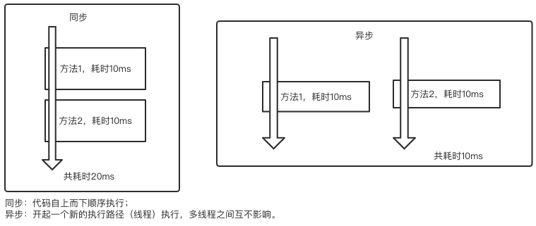
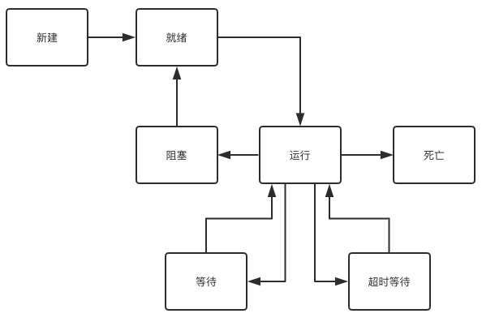

#### 进程与线程  
每个正在系统上运行的程序都是一个进程。每个进程包含一到多个线程。线程是一组指令的集合，或者是程序的特殊段，它可以在程序里独立执行。也可以把它理解为代码运行的上下文。所以线程基本上是轻量级的进程，它负责在单个程序里执行多任务。通常由操作系统负责多个线程的调度和执行。  
使用线程可以把占据时间长的程序中的任务放到后台去处理，程序的运行速度可能加快，在一些等待的任务实现上如用户输入、文件读写和网络收发数据等，线程就比较有用了。在这种情况下可以释放一些珍贵的资源如内存占用等等。  
如果有大量的线程会影响性能，因为操作系统需要在它们之间切换，更多的线程需要更多的内存空间，线程的中止需要考虑其对程序运行的影响。通常块模型数据是在多个线程间共享的，需要防止线程死锁情况的发生。  
总结：进程是所有线程的集合，每一个线程是进程中的一条执行路径。

#### 为什么要使用多线程？  
提高程序的效率。

#### 多线程的使用场景
- 数据库连接池
- 迅雷下载  
此时采用多线程，只能提高下载效率，并不能提高下载速度，下载速度由网络运营商提供的带宽决定。  
多线程下载，即同一时刻，有多个线程（多个执行路径）同时执行下载任务。
- 分发短信

#### 线程的分类
- 用户线程与守护线程
- 主线程（一个进程中一定会有主线程）、子线程、GC线程

#### 多线程的创建方式
- 方式一：继承Thread类，重写run方法
- 方式二：实现Runnable接口，重写run方法（推荐）  
原因实现了接口还可以继续继承，继承了类不能再继承。
- 方式三：使用匿名内部类
- 方式四：使用线程池进行管理

#### 同步与异步
同步和异步通常来形容一次方法调用，同步方法调用一旦开始，调用者必须等到方法调用返回后，才能继续后续的行为。  
异步方法调用更像一个消息传递，一旦开始，方法调用就会立即返回，调用者就可以继续后续的操作。 
异步方法通常会在另外一个线程中“真实”地执行。整个过程，不会阻碍调用者的工作。

#### 多线程的状态（生命周期）
线程从创建、运行到结束总是处于下面七个状态之一：新建状态、就绪状态、运行状态、阻塞状态、等待状态、超时等待状态、以及死亡状态。  

- 新建（初始）状态  
当用new操作符创建一个线程时，例如new Thread(r)，线程还没有开始运行，此时线程处在新建状态。当一个线程处于新建状态时，程序还没有开始运行线程中的代码。

- 就绪（可运行）状态  
一个新创建的线程并不自动开始运行，要执行线程，必须调用线程的start()方法。
当线程对象调用start()方法即启动了线程，start()方法创建线程运行的系统资源，并调度线程运行run()方法。
当start()方法返回后，线程就处于就绪状态。处于就绪状态的线程并不一定立即运行run()方法，线程还必须同其他线程竞争CPU时间。
只有获得CPU时间才可以运行线程。
因为在单CPU的计算机系统中，不可能同时运行多个线程，一个时刻仅有一个线程处于运行状态，因此此时可能有多个线程处于就绪状态。
对多个处于就绪状态的线程是由Java运行时系统的线程调度程序(thread scheduler)来调度的。

> 1. 就绪状态只是说明当前线程有资格运行，调度程序没有挑选到该线程，该线程就永远处于就绪状态。
> 2. 调用线程的start()方法，此线程进入就绪状态。
> 3. 当前线程sleep()方法结束，其他线程join()结束，等待用户输入完毕，某个线程拿到对象锁，这些线程也将进入就绪状态。
> 4. 当前线程时间片用完了，调用当前线程的yield()方法，当前线程进入就绪状态。
> 5. 锁池里的线程拿到对象锁后，进入就绪状态。

- 运行状态    
当线程获得CPU时间后，它才进入运行状态，真正开始执行run()方法.

- 阻塞状态  
线程运行过程中，可能由于各种原因进入阻塞状态:
> 1. 线程通过调用sleep方法进入睡眠状态；
> 2. 线程调用一个在I/O上被阻塞的操作，即该操作在输入输出操作完成之前不会返回到它的调用者；
> 3. 线程试图得到一个锁，而该锁正被其他线程持有；
> 4. 线程在等待某个触发条件；

- 等待    
处于这种状态的线程不会被分配CPU执行时间，它们要等待被显式地唤醒，否则会处于无限期等待的状态。

- 超时等待    
处于这种状态的线程不会被分配CPU执行时间，不过无须无限期等待被其他线程显示地唤醒，在达到一定时间后它们会自动唤醒。

- 死亡（终止）状态  
有两个原因会导致线程死亡：
> 1. run方法正常退出而自然死亡，
> 2. 一个未捕获的异常终止了run方法而使线程猝死。  

当线程的run()方法完成时，或者主线程的main()方法完成时，我们就认为它终止了。这个线程对象也许是活的，但是，它已经不是一个单独执行的线程。线程一旦终止了，就不能复生。  
在一个终止的线程上调用start()方法，会抛出java.lang.IllegalThreadStateException异常。  
为了确定线程在当前是否存活着（就是要么是可运行的，要么是被阻塞了），需要使用isAlive方法。如果是可运行或被阻塞，这个方法返回true； 如果线程仍旧是new状态且不是可运行的，或者线程死亡了，则返回false。

#### 常用线程API

|API|描述|
|:----|:----|
|start()|启动线程|
|currentThread()|获取当前线程对象|
|getID()|获取当前线程ID。Thread-编号，该编号从0开始|
|getName()|获取当前线程名称|
|sleep(long mill)|休眠线程|
|stop()|停止线程|
|Thread()|分配一个新的Thread对象|
|Thread(String name)|分配一个新的Thread对象，具有指定的name。|
|Thread(Runable r)|分配一个新的Thread对象|
|Thread(Runable r, String name)|分配一个新的Thread对象|

#### 守护线程
> Java中有两种线程，一种是用户线程，另一种是守护线程。  
用户线程（非守护线程）是指用户自定义创建的线程，主线程停止，用户线程不会停止。  
守护线程当进程不存在或主线程停止，守护线程也会被停止，例如GC线程。
使用setDaemon(true)方法设置为守护线程。 
 
#### join()方法
当在主线程当中执行到t1.join()方法时，就认为主线程应该把执行权让给t1

#### 线程的优先级
现代操作系统基本采用时分的形式调度运行的线程，线程分配得到的时间片的多少决定了线程使用处理器资源的多少，也对应了线程优先级这个概念。  
在JAVA线程中，通过一个int priority来控制优先级，范围为1-10，其中10最高，默认值为5。下面是源码（基于1.8）中关于priority的一些量和方法。

#### yield()方法
Thread.yield()方法的作用：暂停当前正在执行的线程，并执行其他线程。（可能没有效果）  
yield()让当前正在运行的线程回到可运行状态，以允许具有相同优先级的其他线程获得运行的机会。  
因此，使用yield()的目的是让具有相同优先级的线程之间能够适当的轮换执行。但是，实际中无法保证yield()达到让步的目的，因为，让步的线程可能被线程调度程序再次选中。  
结论：大多数情况下，yield()将导致线程从运行状态转到可运行状态，但有可能没有效果。 